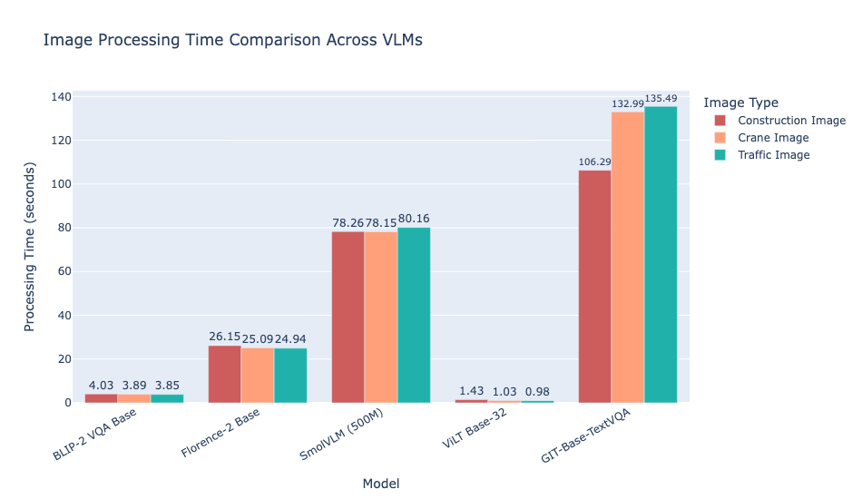
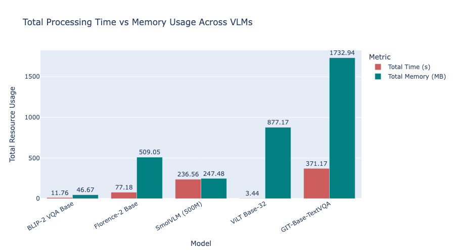
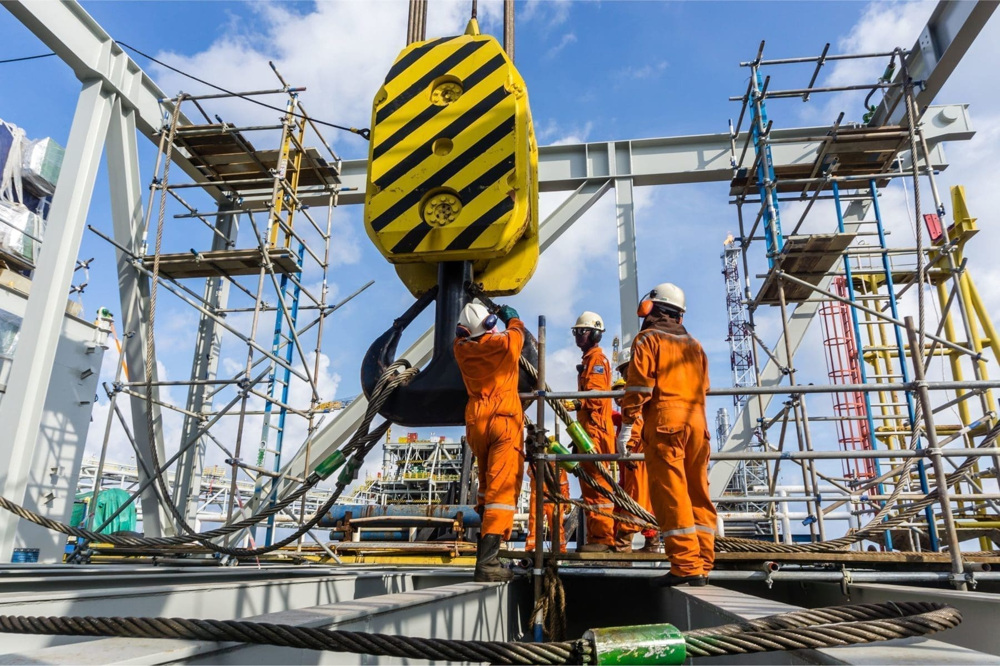

# Evaluation of Vision-Language Models for Industrial Safety Use Cases

## 1. Introduction

This report evaluates lightweight Vision-Language Models (VLMs) suitable for **real-time industrial safety applications**.  
The use cases involve **camera-based monitoring** where models must interpret visual scenes, answer safety-related questions, and provide contextual descriptions (captioning).

**Ideal VLMs should support:**

- Visual Question Answering (VQA)
- Image captioning
- Low-latency inference
- Adaptability via fine-tuning

---

## 2. Selection Criteria

The models were shortlisted and tested based on the following:

- **VQA Capability**: Ability to answer questions grounded in image context
- **Captioning Support**: Ability to generate contextual and relevant descriptions of scenes
- **Lightweight**: Model size under ~7B parameters for real-time feasibility
- **Fine-tunability**: Ease of adapting to domain-specific safety data

---

## 3. Vision Language Models under Consideration

| Model                   | Core Architecture                 | Capabilities (captions, reasoning)     | Size (params) | Real-Time Suitability      | License                  | Safety/Benchmarks                   |
| ----------------------- | --------------------------------- | -------------------------------------- | ------------- | -------------------------- | ------------------------ | ----------------------------------- |
| **LLaVA-1.5-7B**        | CLIP ViT-L/14 + Vicuna/LLaMA-2 7B | Captioning, VQA, dialog                | ~7B           | Moderate (GPU recommended) | LLaMA-2 Community (Meta) | Evaluated on VQA datasets           |
| **Qwen2.5-VL-7B**       | Custom ViT + Qwen-2.5 7B LLM      | Reasoning, OCR, charts, bounding boxes | 7B            | Moderate (GPU; optimized)  | Apache 2.0               | Strong on TextVQA, DocVQA           |
| **OpenFlamingo-4B**     | CLIP ViT-L/14 + RedPajama-3B      | Few-shot captioning, VQA               | 4B            | Moderate (GPU)             | Open (Apache-like)       | Matches Flamingo                    |
| **MiniGPT-4-7B**        | BLIP-2 + Vicuna-7B                | Interactive image Q&A, captioning      | 7B + encoder  | Moderate (GPU)             | BSD-3-Clause             | Good at complex image queries       |
| **BLIP-2 (Flan-T5-xl)** | CLIP ViT + Q-Former + Flan-T5-xl  | Captioning, VQA                        | ~3.9B         | Heavier (GPU)              | MIT                      | Strong on COCO captioning           |
| **SmolVLM-Instruct**    | SigLIP + SmolLM2 (1.7B)           | Captioning, VQA, reasoning             | ~2B           | High (CPU/GPU, ~5GB RAM)   | Apache 2.0               | Competitive (MMMU38.8, TextVQA72.7) |

---

### Short Model Descriptions

- **LLaVA-1.5-7B**: Vision–language assistant excelling at captioning, VQA, and instruction following.
- **Qwen2.5-VL-7B**: Advanced reasoning, OCR, and multilingual support. Strong for charts/docs.
- **OpenFlamingo-4B**: Open-source Flamingo replication; great for few-shot multimodal learning.
- **MiniGPT-4-7B**: GPT-4-Vision–like reasoning for descriptive and analytical visual dialogs.
- **BLIP-2 (Flan-T5-xl)**: Lightweight, strong captioning, fluent VQA with smaller compute budgets.
- **SmolVLM-Instruct**: Tiny instruction-tuned model for CPU/edge deployments.

---

## 4. Vision Language Models for CPU

| Model                  | Params | Quantization | CPU Inference | RAM (approx.) | License    |
| ---------------------- | ------ | ------------ | ------------- | ------------- | ---------- |
| **Florence-2 (base)**  | 0.23B  | FP16 / 8-bit | Few sec/img   | 1–2 GB        | MIT        |
| **Florence-2 (large)** | 0.77B  | FP16 / 8-bit | Few sec/img   | 3–5 GB        | MIT        |
| **BLIP (captioning)**  | ~0.25B | FP16 / 8-bit | ~1–2 s/img    | 1–2 GB        | BSD-3      |
| **SmolVLM (Instruct)** | 2.25B  | FP16/8-bit   | Few sec/img   | ~5 GB         | Apache-2.0 |
| **Moondream v2**       | 1.93B  | BF16 / 8-bit | Few sec/img   | 4–6 GB        | Apache-2.0 |
| **InternVL2-2B**       | 2.2B   | FP16 / 8-bit | Few sec/img   | 6–8 GB        | MIT        |

---

### Short Descriptions

- **Florence-2**: Multitask VLM (captioning, detection, segmentation). Strong zero-shot performance.
- **BLIP**: Captioning model (ViT + Transformer). Deterministic captions, sometimes generic.
- **SmolVLM-Instruct**: Efficient small VLM, strong balance of speed and accuracy.
- **Moondream v2**: Specialized for visual grounding and RLHF-trained QA.
- **InternVL2-2B**: MIT-licensed model pairing ViT encoder + internlm2-chat.

---

## 5. Models Tested

| Model                | VQA | Captioning | Size  | Fine-tuning Support   | Real-Time Feasibility |
| -------------------- | --- | ---------- | ----- | --------------------- | --------------------- |
| **BLIP-2 VQA Base**  | YES | YES        | ~300M | Moderate              | YES                   |
| **Florence-2 Base**  | YES | YES        | ~500M | Experimental          | YES                   |
| **SmolVLM (500M)**   | YES | NO         | ~500M | Instruction-tuned     | YES                   |
| **ViLT Base-32**     | YES | NO         | ~86M  | Limited               | YES (low quality)     |
| **GIT-Base-TextVQA** | YES | YES        | ~300M | Pretrained on TextVQA | YES                   |

---

## 6. Safety Questions

The following **questions were asked** to each model:

1. Are there any people in the image not wearing hardhats?
2. Do all visible workers have safety vests on?
3. Is anyone in the image located inside a restricted or unauthorized zone?
4. Are there any vehicles dangerously close to workers in the image?
5. Is anyone missing required PPE like safety boots, vests, or helmets?
6. Is there an unsafe distance between any vehicle and a person?
7. Are all workers following proper industrial safety protocols?
8. Is anyone working in an area they should not be in?
9. Are there any visible safety violations in this image?
10. Does the image show any hazards that could pose a threat to worker safety?

---

## 7. Testing Results

### Comparison of Image Processing Times (including prompt inferences)

### Comparison of Memory Consumption (with total time)

### Sample Responses

#### A. Construction Image

**Question:** Does the image show any hazards that could pose a threat to worker safety?

| Model            | Response                                                                                      |
| ---------------- | --------------------------------------------------------------------------------------------- |
| BLIP-2 VQA Base  | yes                                                                                           |
| Florence-2 Base  | image show any hazards that could pose a threat to worker safety                              |
| SmolVLM (500M)   | Yes, the image shows scaffolding, which could pose a risk to workers if not properly managed. |
| ViLT Base-32     | yes                                                                                           |
| GIT-Base-TextVQA | does the image show any hazards ... yes                                                       |

---

#### B. Crane and Tracks Image

**Question:** Does the image show any hazards that could pose a threat to worker safety?

| Model            | Response                                                                                                                     |
| ---------------- | ---------------------------------------------------------------------------------------------------------------------------- |
| BLIP-2 VQA Base  | yes                                                                                                                          |
| Florence-2 Base  | image show any hazards that could pose a threat to worker safety                                                             |
| SmolVLM (500M)   | Yes, the image shows workers wearing safety helmets, which may indicate a hazardous environment (e.g., near railway tracks). |
| ViLT Base-32     | yes                                                                                                                          |
| GIT-Base-TextVQA | unanswerable                                                                                                                 |

---

#### C. Traffic Zone Image

**Question:** Does the image show any hazards that could pose a threat to worker safety?

| Model            | Response                                                                        |
| ---------------- | ------------------------------------------------------------------------------- |
| BLIP-2 VQA Base  | Yes                                                                             |
| Florence-2 Base  | image show any hazards that could pose a threat to worker safety safety         |
| SmolVLM (500M)   | Yes, there is a road roller in the image, which could pose a hazard to workers. |
| ViLT Base-32     | Yes                                                                             |
| GIT-Base-TextVQA | no                                                                              |

---

## 8. Conclusion

- **SmolVLM (500M)** consistently outperformed other models in reasoning about context and identifying visible safety risks.
- **Florence and GIT-based models** often struggled with precise grounding or language alignment.
- This indicates a need for **domain-specific fine-tuning** or VQA models trained on safety-oriented datasets to ensure reliability in **real-world safety-critical deployments**.

---

📅 **Date Published:** August 6, 2025
