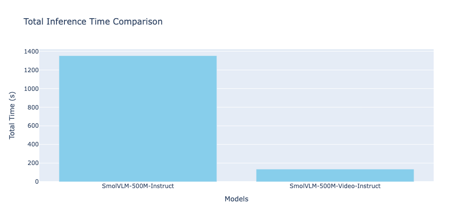
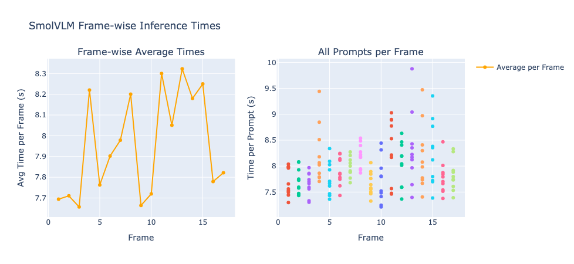

# Evaluation of SmolVLM-500M models on Industrial Safety use cases

## 1. Introduction

Visual agents in industrial safety use cases focus on **real-time detection of industrial and construction site safety violations** through computer vision and **vision-language models (VLMs)**.  
The goal is to automatically detect violations such as:

- Missing PPE (hardhats, safety vests, boots)
- Unauthorized access to restricted areas
- Unsafe vehicle proximity to personnel

We tested two inference modes using **SmolVLM**:

- **Frame-wise inference** (simulating real-time streaming safety monitoring)
- **Whole-video inference** (offline captioning/analysis of the full video at once)

### Safety Prompts Used

1. Are there any people in the video not wearing hardhats?
2. Do all visible workers have safety vests on?
3. Is anyone in the video located inside a restricted or unauthorized zone?
4. Are there any vehicles dangerously close to workers in the video?
5. Is anyone missing required PPE like safety boots, vests, or helmets?
6. Is there an unsafe distance between any vehicle and a person?
7. Are all workers following proper industrial safety protocols?
8. Is anyone working in an area they should not be in?
9. Are there any visible safety violations in this video?
10. Does the video show any hazards that could pose a threat to worker safety?

---

## 2. Experimental Setup

### SmolVLM-500M-Instruct

- **Hardware:** CPU-only inference
- **Video:** Industrial/construction site footage
- **Evaluation:**
  - Frame-wise inference and timing trends
  - Total inference time

### SmolVLM2-500M-Video-Instruct

- **Hardware:** CPU-only inference
- **Video:** Industrial/construction site footage
- **Evaluation:**
  - Whole video inference
  - Total inference time

---

## 3. Results

### A. Total Inference Times

- **Frame-wise inference:** 1352.79 seconds
- **Whole-video inference:** 134.95 seconds

Whole-video inference is ~10× faster than processing each frame individually.

**Plot 1:** Total Inference Time Comparison

---

### B. Frame-wise Timing Trend

Frame-wise inference times varied across frames but generally showed consistent per-frame latency, making it suitable for streaming safety checks (though slower overall).

**Plot 2:** Frame-wise Inference Time per Frame

---

## 4. Discussion

### Whole-video inference

- Much faster (10× speedup).
- Good for **offline safety audits**, e.g., reviewing recorded footage.
- Not suitable for **real-time safety monitoring**, since the system needs the full video first.

### Frame-wise inference

- Simulates **real-time streaming safety monitoring**.
- Slower in total runtime, but allows **timely detection per frame** that can trigger instant alerts.
- Aligns better with **industrial safety requirements**, where worker safety depends on immediate detection.

---

## 5. Conclusion

- **SmolVLM Video (whole-video)** → computationally efficient, useful for **post-event analysis or safety audits**.
- **SmolVLM Frame-wise** → slower but supports **real-time industrial safety monitoring**, enabling instant hazard detection.

**Trade-off:**

- **Speed vs Timeliness** — whole-video is faster, but frame-wise is more practical for real-time safety-critical applications.

---

## 6. Next Steps

Real-time inference for **AI4Safety** is **non-negotiable**.  
While models such as **SmolVLM-Video** demonstrate faster inference, their limitations prevent deployment in our primary use case.  
Next steps will focus on **benchmarking alternatives** capable of frame-by-frame inference with lower latency yet improved accuracy, ensuring both responsiveness and reliability.

---

## Other Vision Language Models

Beyond SmolVLM, further research included **Flash-VStream**, explicitly designed for real-time streaming.  
However, at **7B parameters**, it may be **too heavy for CPU or production environments**.

A promising extension is **ReKV**.

### ReKV

- **Problem in Traditional VideoQA:** Full video must be processed before answering; repeated for every query.
- **Solution:** Streaming-style analysis — responses are immediate, no reprocessing needed.
- **Design:** Decouples video analysis from question answering → workload distributed across processes/GPUs → reduced latency.
- **Model Support:** Training-free, model-agnostic, works with multiple VLMs.

---

## Supported Models (Research Review)

| Model               | # Parameters    | Features                                                                                 |
| ------------------- | --------------- | ---------------------------------------------------------------------------------------- |
| **Flash-VStream**   | 7B              | Real-time streaming VLM, optimized for low-latency, frame-by-frame safety                |
| **LLaVA-OneVision** | 0.5B / 7B / 72B | Unified image/video reasoning, strong benchmarks, general-purpose, not latency-optimized |
| **Qwen2-LongVA**    | 7B              | Long-context multimodal reasoning, good for long video analysis                          |
| **Video-LLaVA**     | 7B              | Video-level holistic reasoning, processes full clips, not streaming-optimized            |

---

## Current Plan

The research direction is to **expand investigations into StreamingVQA models**, aiming to:

- Balance inference **speed and accuracy**
- Enable **real-time safety monitoring** in industrial contexts
- Maintain **low-latency hazard detection** for worker protection

The ultimate goal is a **deployable safety monitoring agent** that can operate efficiently in real-world industrial environments.

---
